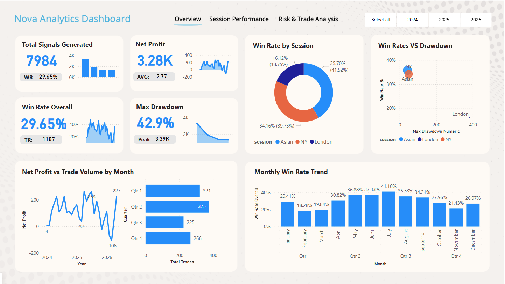
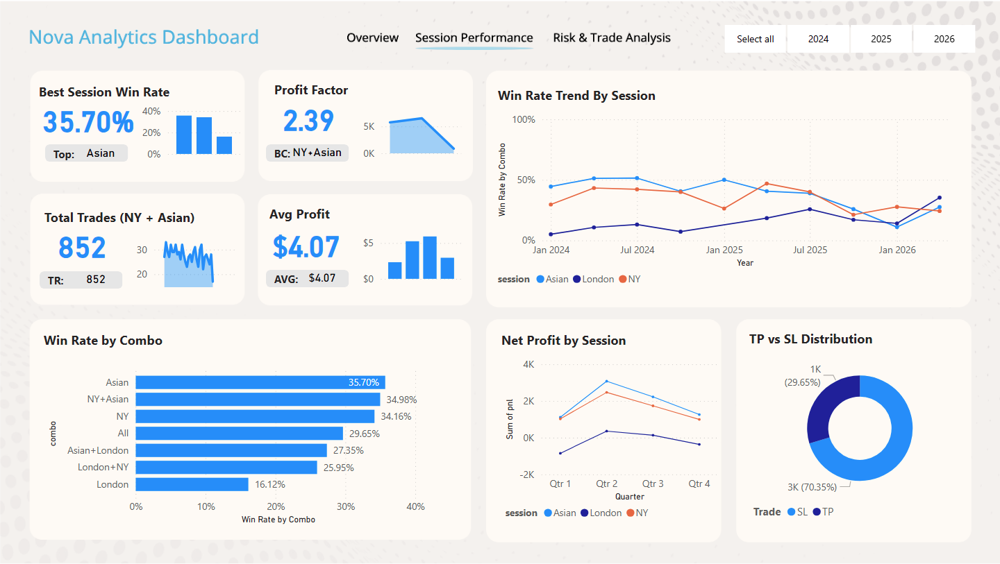
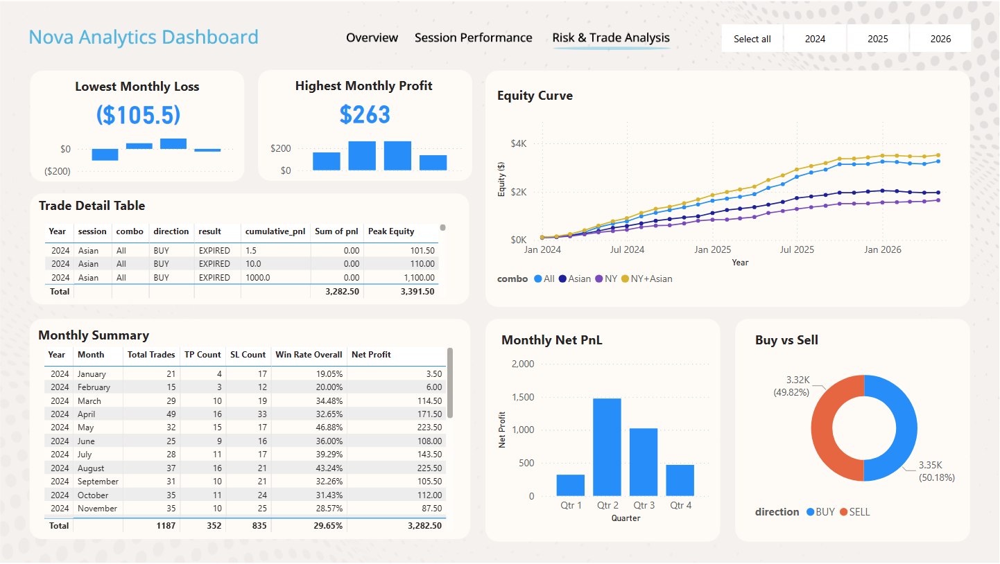

# Nova Analytics Dashboard — XAUUSD Trading System Performance



---

## Problem Statement

I built an algorithmic trading system that predicts XAUUSD (gold) session highs and lows using XGBoost. After 2 years of development and simulation, I had 7,984 rows of trade data across 3 sessions and 7 combo configurations. The problem was simple: I could not see the full picture from raw CSV files alone.

I needed a dashboard that answers three questions:
- Is the system profitable overall?
- Which session and combo performs best?
- What does the risk profile actually look like?

---

## Data Preparation

**Source:** Python simulation output from walk-forward validation across 7 years of M15 XAUUSD data (2019-2026).

**Export script:** `export_powerbi_v6.py` reads from `simulation_walkforward/simulation_EXP01_all.csv` and outputs a single clean CSV for Power BI.

**What the script does:**
- Merges all 7 combo results into one flat table (7,984 rows)
- Derives `year`, `month`, `month_name`, `month_year`, `quarter` columns from `date`
- Calculates `is_win` and `is_loss` flags from the `result` column
- Computes `cumulative_pnl` per combo using running sum of `pnl`
- Computes `running_equity` starting from $100 base capital
- Computes `drawdown_pct` and `max_drawdown_to_date` per combo per row

**Output:** `5. PowerBI/powerbi_dashboard_v6.csv` — 7,984 rows, 25 columns.

---

## Key Measures (DAX)

```dax
Win Rate Overall =
DIVIDE(
    CALCULATE(COUNT('powerbi_dashboard_v6'[result]),
        'powerbi_dashboard_v6'[combo] = "All",
        'powerbi_dashboard_v6'[result] = "TP"),
    CALCULATE(COUNT('powerbi_dashboard_v6'[result]),
        'powerbi_dashboard_v6'[combo] = "All",
        'powerbi_dashboard_v6'[result] IN {"TP", "SL"})
)
```

```dax
Net Profit =
CALCULATE(
    SUM('powerbi_dashboard_v6'[pnl]),
    'powerbi_dashboard_v6'[combo] = "All"
)
```

```dax
Max Drawdown =
ROUND(
    CALCULATE(
        MAX('powerbi_dashboard_v6'[max_drawdown_to_date]),
        'powerbi_dashboard_v6'[combo] = "All"
    ), 1
) & "%"
```

```dax
Profit Factor NY+Asian =
DIVIDE(
    CALCULATE(SUM('powerbi_dashboard_v6'[pnl]),
        'powerbi_dashboard_v6'[combo] = "NY+Asian",
        'powerbi_dashboard_v6'[result] = "TP"),
    ABS(CALCULATE(SUM('powerbi_dashboard_v6'[pnl]),
        'powerbi_dashboard_v6'[combo] = "NY+Asian",
        'powerbi_dashboard_v6'[result] = "SL"))
)
```

```dax
Best Session WR =
MAXX(
    VALUES('powerbi_dashboard_v6'[session]),
    CALCULATE(
        DIVIDE(
            CALCULATE(COUNT('powerbi_dashboard_v6'[result]),
                'powerbi_dashboard_v6'[result] = "TP"),
            CALCULATE(COUNT('powerbi_dashboard_v6'[result]),
                'powerbi_dashboard_v6'[result] IN {"TP", "SL"})
        ),
        'powerbi_dashboard_v6'[combo] = "All"
    )
)
```

```dax
Win Rate by Combo =
DIVIDE(
    CALCULATE(COUNT('powerbi_dashboard_v6'[result]),
        'powerbi_dashboard_v6'[result] = "TP"),
    CALCULATE(COUNT('powerbi_dashboard_v6'[result]),
        'powerbi_dashboard_v6'[result] IN {"TP", "SL"})
)
```

---

## Analysis & Modeling

The dashboard covers three angles:

**Page 1: Overview**
System-level health check. Win rate, net profit, drawdown, and signal volume for the "All" combo. Includes win rate breakdown by session and quarterly trade volume.

**Page 2: Session Performance**
Compares all 7 combos side by side. Ranks win rate per combo and tracks win rate trend over time per session. NY+Asian leads with profit factor 2.39 and 852 trades.

**Page 3: Risk & Trade Analysis**
Equity curve from $100 across 4 combos (2024-2026). Monthly summary table with TP/SL count and net profit per month. BUY vs SELL distribution and quarterly net PnL breakdown.

---

## Visuals

**Page 1: Overview**


**Page 2: Session Performance**



**Page 3: Risk & Trade Analysis**



---

## Business Insights

**1. NY+Asian is the best combo to run live.**
Profit factor 2.39, 35% win rate, max drawdown 27.3%. It generates $3,467 net profit from $100 capital over 2 years on 852 trades. That is the strongest risk-adjusted result across all 7 configurations.

**2. London session should not run standalone.**
Win rate 16.12%, profit factor below 1.0, max drawdown 98.7% with 3 margin calls. It consistently pulls down any combo it joins.

**3. The system is directionally balanced.**
49.82% BUY vs 50.18% SELL. The model does not bias toward one direction, which rules out a simple trending bias as the source of edge.

**4. Q2 is the strongest quarter.**
Across all combos, Q2 generates the highest trade volume (375 trades) and highest net profit. Q3 is weakest. Any live deployment should expect seasonal variance.

**5. Feb-March 2026 is a blind spot.**
Both months show negative PnL across all combos. Feb-March 2026 coincided with high geopolitical volatility in gold markets. The model was not trained to handle regime shifts of that magnitude.
